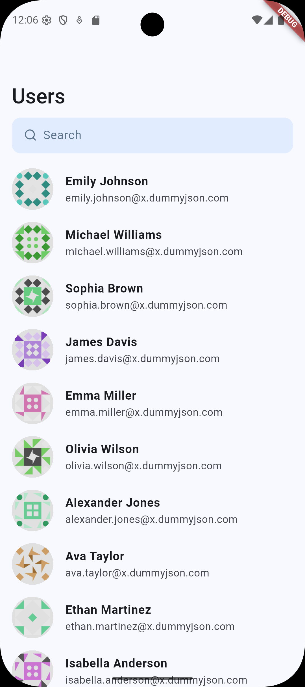
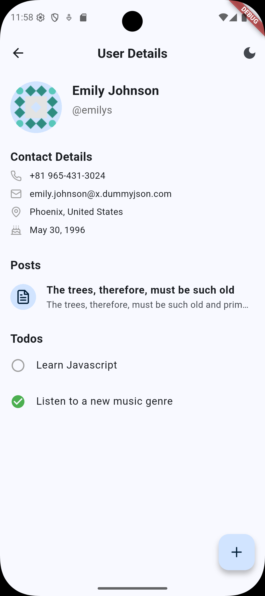
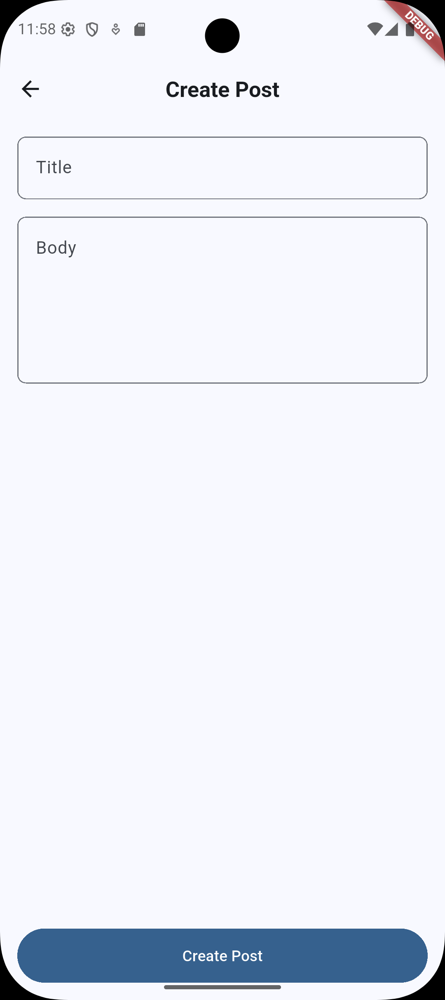

# 📱 Internship Assignment

A feature-rich Flutter application developed as an internship assignment, showcasing advanced state management, API integration, and responsive UI components.

 

---

## 🚀 Features

* **User List with Pagination & Search:**

  * Fetches users from the [DummyJSON Users API](https://dummyjson.com/users) with pagination support using `limit` and `skip` parameters.
  * Implements real-time search functionality by user name.
  * Supports infinite scrolling to load more users seamlessly.

* **User Details:**

  * Displays comprehensive user information, including contact details.
  * Fetches and displays user-specific posts and todos from:

    * Posts: `https://dummyjson.com/posts/user/{userId}`
    * Todos: `https://dummyjson.com/todos/user/{userId}`

* **Create Post:**

  * Allows users to create new posts locally with a title and body.
  * Stores created posts using Hive for local persistence.

* **Skeleton Loading Effects:**

  * Utilizes the `shimmer` package to display skeleton loaders during data fetching, enhancing user experience.
  * Skeleton loaders are implemented for user list items, posts, and todos.

* **Theme Management:**

  * Supports light and dark themes.
  * Persists theme preference using Hive for a consistent user experience.

* **Pull-to-Refresh:**

  * Enables users to refresh the user list and user details via pull-to-refresh gestures.

---

## 🧠 Architecture

The application follows a clean architecture pattern, ensuring scalability and maintainability.

* **State Management:**

  * Utilizes `flutter_bloc` for managing application state.
  * Implements separate BLoCs and Cubits for different features:

    * `UserBloc` for user list operations.
    * `UserDetailsBloc` for user details, posts, and todos.
    * `CreatePostCubit` for post creation.
    * `ThemeCubit` for theme management.

* **Data Layer:**

  * Employs `dio` for HTTP requests to interact with the DummyJSON API.
  * Uses `Hive` for local data storage, including caching posts and persisting theme preferences.

* **UI Layer:**

  * Designed with responsiveness and user experience in mind.
  * Incorporates skeleton loaders using the `shimmer` package to indicate loading states.
  * Organized into reusable widgets for consistency and modularity.

---

## 📂 Project Structure

```bash
lib/
├── blocs/
│   ├── user_bloc/
│   ├── user_details_bloc/
│   ├── create_post_cubit/
│   └── theme_cubit/
├── models/
│   ├── user/
│   ├── post/
│   └── todo/
├── services/
│   ├── user_service.dart
│   └── user_details_service.dart
├── screens/
│   ├── user_list/
│   ├── user_details/
│   └── create_post/
├── widgets/
│   ├── custom_search_bar.dart
|   └── list_items
│       ├── user_list_item.dart
│       ├── post_list_item.dart
│       └── todo_list_item.dart
│   └── skeletons/
│       ├── user_list_item_skeleton.dart
│       ├── post_list_item_skeleton.dart
│       └── todo_list_item_skeleton.dart
├── theme/
│   └── app_theme.dart
└── main.dart
```


---

## 🛠️ Setup Instructions

1. **Clone the Repository:**

   ```bash
   git clone https://github.com/PearlGrell/internship_assignment.git
   cd internship_assignment
   ```


2. **Install Dependencies:**

   ```bash
   flutter pub get
   ```


3. **Generate Hive Type Adapters:**

   ```bash
   flutter pub run build_runner build --delete-conflicting-outputs
   ```


4. **Run the Application:**

   ```bash
   flutter run
   ```


---

## 📸 Screenshots

| User List Screen                                | User Details Screen                                | Create Post Screen                                 |
| ----------------------------------------------- | -------------------------------------------------- | -------------------------------------------------- |
|  |  |  |

---

## 📦 Dependencies

| Package                                                       | Description                                    |                                                                   |
| ------------------------------------------------------------- | ---------------------------------------------- | ----------------------------------------------------------------- |
| [flutter\_bloc](https://pub.dev/packages/flutter_bloc)        | State management using BLoC pattern.           |                                                                   |
| [dio](https://pub.dev/packages/dio)                           | HTTP client for API interactions.              |                                                                   |
| [hive\_ce](https://pub.dev/packages/hive_ce)                  | Lightweight and fast key-value database.       |                                                                   |
| [hive\_ce\_flutter](https://pub.dev/packages/hive_ce_flutter) | Hive integration for Flutter.                  |                                                                   |
| [json\_annotation](https://pub.dev/packages/json_annotation)  | Annotations for JSON serialization.            |                                                                   |
| [shimmer](https://pub.dev/packages/shimmer)                   | Provides shimmer loading effect.               |                                                                   |
| [intl](https://pub.dev/packages/intl)                         | Internationalization and localization support. |                                                                   |
| [lucide\_icons](https://pub.dev/packages/lucide_icons)        | Icon pack for Flutter.                         | 


---

## 🙋‍♂️ Author

**PearlGrell**

* GitHub: [@PearlGrell](https://github.com/PearlGrell)
